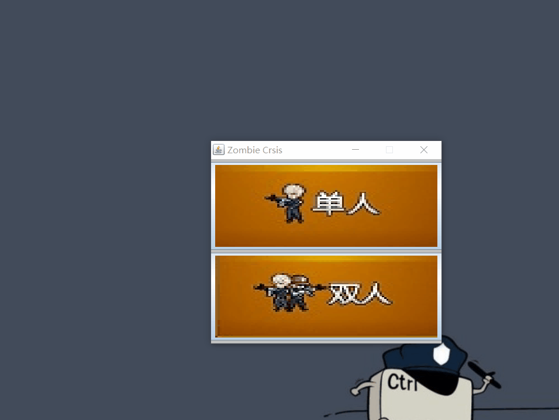
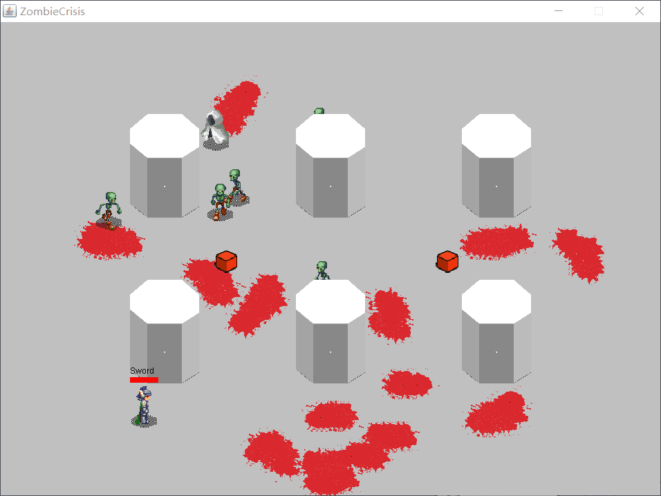

# HeroCrisis
出处为https://github.com/Hpasserby/ZombieCrisis.git  
JAVA 射击生存类小游戏
直接复制链接idea找到start包中的Main类运行即可

游戏说明:  
面对持续增加而来的怪物你能抵挡多久  
吃到箱子可以回复血量或火球值(初始为80)
操作说明：
	1P: WASD + J(攻击) + K(切换武器) + L(大招)
	2P: 上下左右 +  1(攻击) + 2(切换武器) + 3(大招)

效果演示：
  
  

gameObject存放游戏主要物体  
people存放moster(怪物) hero(人物) ghost(幽灵)  
Role放置游戏的基本规则  
start防止游戏的界面和键盘监听器和主方法的类  
WeaponChildren放置武器的子类  
WeaponFather放置武器的父类  
image放置游戏需要的素材图片  
music放置游戏需要的音乐素材  
游戏的主要几个规则  
游戏中的物体都具有速度,由半径来代表人物的范围大小 
利用x和y坐标勾股定理得到的值用x y 求出角度,用Math中的to  再用半径乘弧度制
表示碰撞的距离,血量,x和y坐标来定位  
僵尸根据节点移动  
通过坐标的方式取出来物体然后画出  

